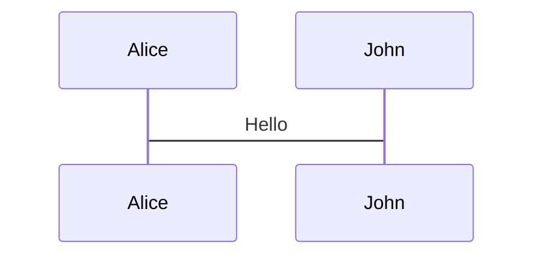

# Slidev Syntax & Common Patterns

Common patterns and syntax for creating slides.

## Slide Separators

Use `---` padded with a new line to separate slides:

```markdown
# Title

Hello, **Slidev**!

---

# Slide 2

More content.
```

## Frontmatter

Each slide can have frontmatter between `---` markers:

**Styling:** `class: text-center`, `class: px-20`

**Layouts:** `layout: two-cols`, `layoutClass: gap-16`, `layout: center`, `layout: image-right`

**Importing Slides:**

```markdown
---
src: ./pages/imported-slides.md
hide: false
---
```

## Layouts

### Two-Column Layout

```markdown
---
layout: two-cols
layoutClass: gap-16
---

# Slide Title

Left column content.

::right::

Right column content.
```

**Important:** Do NOT use `::left::` markers. Content before `::right::` goes left, after goes right.

### Grid Layouts

```html
<div grid="~ cols-2 gap-4">
  <div>Column 1</div>
  <div>Column 2</div>
</div>
```

Common patterns: `grid="~ cols-2 gap-4"`, `grid="~ cols-4 gap-5 pt-4"`

## Media

### Icons

**Component:** `<carbon:arrow-right />`, `<carbon:edit />`

**Class:** `<div class="i-carbon:arrow-up" />`

**Button:** `<button class="slidev-icon-btn"><carbon:edit /></button>`

### Images

```html


```

**Layout via Frontmatter:**

```markdown
---
layout: image-right
image: https://cover.sli.dev
---
```

## Components

Components auto-import from `slides/components/`. See [slides/components/README.md](./slides/components/README.md) for details.

### QRCode

```html
<QRCode url="https://example.com" />
<QRCode url="https://example.com" size="250" caption="Scan to visit" />
```

**Props:** `url` (required), `size` (default 200), `caption` (optional)

### Callout

```html
<Callout type="info">Information</Callout>
<Callout type="warning" title="Important">Warning text</Callout>
```

**Types:** `info`, `warning`, `success`, `error`, `tip`, `note`

## Code

### Basic Code Blocks

```typescript
function greet(name: string) {
  return `Hello, ${name}!`
}
```

### Line Highlighting

```ts {2,3}
function add(
  a: number,
  b: number
) {
  return a + b
}
```

For advanced code features, see [ADVANCED.md](./ADVANCED.md).

## Animations

### Basic Click Animations

**v-click:**

```html
<div v-click>Appears on first click</div>
<div v-click>Appears on second click</div>
```

**v-clicks:**

```html
<v-clicks>
- Item 1
- Item 2
- Item 3
</v-clicks>
```

For detailed animation guides and alignment, see [POLISHING.md](./POLISHING.md).

## Presenter Notes

HTML comments create presenter notes:

```html
<!--
The last comment block of each slide will be treated as slide notes.
It will be visible and editable in Presenter Mode.
-->
```

For syncing notes with click animations, see [POLISHING.md](./POLISHING.md).

## LaTeX

**Inline:** `$\sqrt{3x-1}+(1+x)^2$`

**Block:**

```markdown
$$
\begin{aligned}
\nabla \cdot \vec{E} &= \frac{\rho}{\varepsilon_0}
\end{aligned}
$$
```

## Diagrams

### Mermaid



**Options:** `{scale: 0.5}`, `{theme: 'neutral'}`, `{alt: 'description'}`

