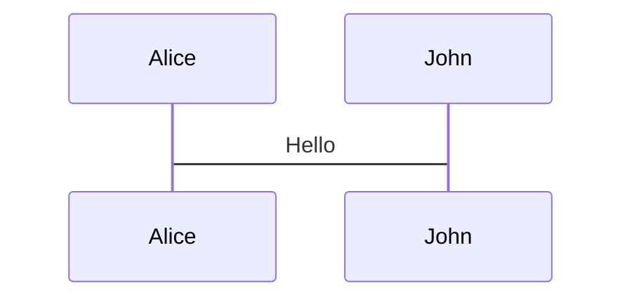
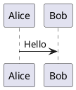

# Complete Slidev Reference

Complete syntax reference for all Slidev features. Use this as a lookup when you need specific details.

## Slide Separators

```markdown
---
# Frontmatter
---

# Slide Content

---

# Next Slide
```

## Frontmatter Options

**Styling:**
- `class: text-center`
- `class: text-left`
- `class: px-20`

**Layouts:**
- `layout: two-cols`
- `layout: center`
- `layout: image-right`
- `layout: image-left`
- `layout: image`
- `layoutClass: gap-16`

**Importing:**
- `src: ./pages/imported-slides.md`
- `hide: false`

**Other:**
- `level: 2` - Section break
- `transition: slide-left` - Slide transition
- `mdc: true` - Enable MDC syntax

## Layouts

### Two-Column

```markdown
---
layout: two-cols
layoutClass: gap-16
---

# Title

Left content.

::right::

Right content.
```

### Grid

```html
<div grid="~ cols-2 gap-4">
  <div>Item 1</div>
  <div>Item 2</div>
</div>
```

## Components

### QRCode

```html
<QRCode url="https://example.com" />
<QRCode url="https://example.com" size="250" caption="Scan" />
```

**Props:** `url` (required), `size` (default 200), `caption` (optional)

### Callout

```html
<Callout type="info">Info</Callout>
<Callout type="warning" title="Title">Warning</Callout>
```

**Types:** `info`, `warning`, `success`, `error`, `tip`, `note`

### Chart

```html
<Chart 
  type="bar" 
  title="Title"
  :labels="['A', 'B', 'C']"
  :datasets="[{ label: 'Data', data: [1, 2, 3] }]"
  :height="400"
/>
```

**Types:** `bar`, `line`, `doughnut`

### FileExplorer

```html
<FileExplorer dir="components/example_fs/fastapi-app" />
```

**Props:** `dir` (required) - Path relative to `slides/decks/`

### Terminal

```html
<Terminal command="npm install" output="installed" />
<Terminal :lines="[{ command: 'cd app', output: 'done' }]" />
```

**Props:** `command`, `output`, `lines`, `prompt` (default '$'), `shell` (default 'bash'), `height` (default 300)

### AgentView

```html
<AgentView 
  :events="[
    { type: 'user', content: 'Question' },
    { type: 'assistant', content: 'Answer' }
  ]"
/>
```

See [slides/components/README.md](./slides/components/README.md) for full component details.

## Code

### Basic

```typescript
function example() {
  return 'code'
}
```

### Line Highlighting

```ts {2,3}
function example(
  param: string
) {
  return param
}
```

### Dynamic Highlighting

```ts {2-3|5|all}
function example(
  param: string,
  other: number
) {
  return param
}
```

### Monaco Editor

```ts {monaco}
const code = 'editable'
```

### Monaco Diff

```ts {monaco-diff}
const old = 'original'
~~~
const new = 'updated'
```

### Monaco Run

```ts {monaco-run}
console.log('executable')
```

### Code Snippets

```markdown
<<< @/snippets/external.ts#snippet
```

## Animations

### v-click

```html
<div v-click>Appears on click 1</div>
<div v-click>Appears on click 2</div>
```

### v-after

```html
<div v-click>Click 1</div>
<div v-after>Also click 1</div>
```

### v-clicks

```html
<v-clicks>
- Item 1
- Item 2
- Item 3
</v-clicks>
```

**Options:**
- `depth="2"` - Nested lists
- `every="2"` - Group items

### Hide

```html
<div v-click.hide>Hidden after click</div>
```

### v-mark

```html
<span v-mark.underline="1">Underline</span>
<span v-mark.circle="2">Circle</span>
<span v-mark.box="3">Box</span>
<span v-mark.highlight="{ at: 1, color: '#fef08a' }">Highlight</span>
```

**Types:** `underline`, `circle`, `box`, `highlight`

**Colors:** `red`, `orange`, or custom `{ color: '#234' }`

### v-motion

```html
<div
  v-motion
  :initial="{ x: -80, opacity: 0 }"
  :enter="{ x: 0, opacity: 1 }"
  :click-3="{ x: 80 }"
  :leave="{ x: 1000 }"
>
  Content
</div>
```

## Presenter Notes

```html
<!--
The last comment block is treated as presenter notes.

[click] This highlights on first click

[click] This highlights on second click

[click:3] This highlights on third click (skip two)
-->
```

## LaTeX

**Inline:** `$\sqrt{3x-1}+(1+x)^2$`

**Block:**

```markdown
$$
\begin{aligned}
\nabla \cdot \vec{E} &= \frac{\rho}{\varepsilon_0}
\end{aligned}
$$
```

## Diagrams

### Mermaid



**Options:** `scale`, `theme`, `alt`

### PlantUML



## Icons

**Component:** `<carbon:arrow-right />`

**Class:** `<div class="i-carbon:arrow-up" />`

**Button:** `<button class="slidev-icon-btn"><carbon:edit /></button>`

## Images

```html


```

**Layout:**

```markdown
---
layout: image-right
image: https://cover.sli.dev
---
```

## MDC Syntax

```markdown
---
mdc: true
---

[styled text]{style="color:red"}

{width=500px lazy}

::component{prop="value"}
Content
::
```

## Slide Transitions

```markdown
---
transition: slide-left
---
```

**Options:** `slide-left`, `slide-right`, `slide-up`, `slide-down`, `fade`, `fade-out`, `zoom`, `none`

