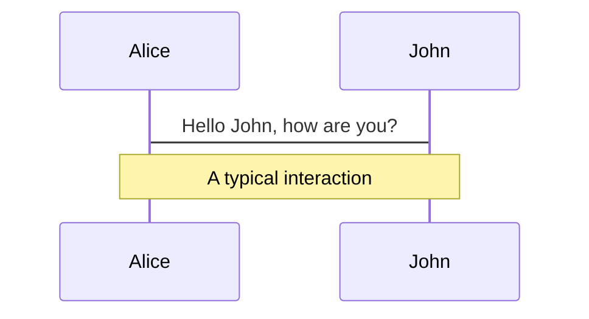
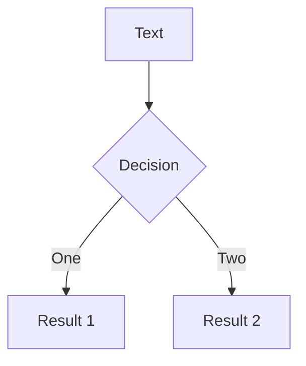

# Slidev Markdown Guide

This guide covers the basics of Slidev markdown and the first-draft workflow for building presentations. Keep the content clean before adding polish; for animations, advanced code, and synced notes see [SLIDEV_POLISHING.md](./SLIDEV_POLISHING.md).

## Workflow: Content First, Polish Later

### First draft approach

- Focus on your story and the flow between slides.
- Use the simplest layouts that keep ideas readable.
- Draft speaker notes as you go—capture the full thought, not just a bullet.
- Skip click animations and polished code blocks until the structure feels solid.

### Ready for polish

- Once the narrative is stable, open [`SLIDEV_POLISHING.md`](./SLIDEV_POLISHING.md).
- Add click reveals, advanced code treatments, and synced presenter notes.
- Tidy visuals only where they help clarify or emphasize.

Don’t try to perfect everything at once. Build the material first, then polish the slides that benefit most.

## Basics Reminder

Use the sections below for the exact syntax for slide separators, frontmatter, layouts, media, components, code, animations, notes, math, and diagrams. This document now covers both “how” and “workflow”—draft with confidence, then switch to `SLIDEV_POLISHING.md` for polish.

## Basics

### Slide Separators

Use `---` padded with a new line to separate slides:

```markdown
# Title

Hello, **Slidev**!

---

# Slide 2

Use code blocks for highlighting.

---

# Slide 3

Use UnoCSS classes and Vue components.
```

### Frontmatter

Each slide separated by `---` has its own frontmatter. Add frontmatter options between the `---` markers at the top of each slide.

**Styling:** `class: text-center`, `class: px-20`

**Layouts:** `layout: two-cols`, `layoutClass: gap-16`, `layout: center`, `layout: image-right`

**Importing Slides:**

Import slides from other markdown files using `src` in frontmatter:

```markdown
---
src: ./pages/imported-slides.md
hide: false
---
```

## Layouts

### Two-Column Layout

**Frontmatter:**

```markdown
---
layout: two-cols
layoutClass: gap-16
---
```

**Content:**

Use the `::right::` marker to separate left and right column content. **Important:** Do NOT use `::left::` markers. All content before `::right::` automatically appears in the left column, and all content after `::right::` appears in the right column.

```markdown
# Slide Title

Content for the left column goes here.
This can include multiple paragraphs, lists, etc.

::right::

# Right Column Title

Content after the `::right::` marker goes in the right column.
```

**Note:** The title can be placed before `::right::` and will span both columns or appear at the top of the slide.

### Grid Layouts

Use UnoCSS grid syntax for flexible layouts:

```html
<div grid="~ cols-2 gap-4">
  <div>Column 1</div>
  <div>Column 2</div>
</div>

<div grid="~ cols-4 gap-5 pt-4">
  <div>Item 1</div>
  <div>Item 2</div>
  <div>Item 3</div>
  <div>Item 4</div>
</div>
```

**Common Grid Patterns:**

- `grid="~ cols-2 gap-4"` - Two columns with gap
- `grid="~ cols-4 gap-5 pt-4"` - Four columns with gap and padding
- `grid="~ cols-2 gap-2"` - Two columns with smaller gap

## Media

### Icons

**Component:** `<carbon:arrow-right />`, `<carbon:edit />`, `<carbon:logo-github />`

**Class:** `<div class="i-carbon:arrow-up" />`

**Button:** `<button class="slidev-icon-btn" title="Action"><carbon:edit /></button>`

Carbon icons are available by default. Use `<carbon:icon-name />` for inline icons or `i-carbon:icon-name` class for icon fonts.

### Images

**Basic:** ``

**Rounded:** ``

**Positioned:** ``

**Layout via Frontmatter:**

```markdown
---
layout: image-right
image: https://cover.sli.dev
---
```

**Common Patterns:** `border="rounded"`, `class="w-80"`, `class="opacity-50"`, `class="absolute -bottom-9 -left-7"`

## Components

### Components in Slides

Slidev allows you to use Vue components directly in your slides without importing them manually (thanks to unplugin-vue-components).

**Using Components:**

```markdown
# My Slide

<MyComponent :count="4"/>
```

**Component Sources:**

- Built-in components (see Built-in Components)
- Provided by themes and addons
- Custom components in the `components/` directory

**Writing Custom Components:**

Create Vue files in the `components/` directory:

```text
your-slidev/
  ├── ...
  ├── slides.md
  └── components/
      ├── ...
      └── MyComponent.vue
```

### AutoFitText Component

Box inside which the font size will automatically adapt to fit the content. Similar to PowerPoint or Keynote TextBox.

**Usage:**

```html
<AutoFitText :max="200" :min="100" modelValue="Some text"/>
```

**Props:**

- `max` (string | number, default 100): Maximum font size
- `min` (string | number, default 30): Minimum font size
- `modelValue` (string, default ''): Text content

### QRCode Component

Generate QR codes dynamically in your slides. Useful for sharing links, resources, or follow-up materials.

**Location:** `slides/components/QRCode.vue`

**Usage:**

```html
<QRCode url="https://example.com" />
<QRCode url="https://example.com" size="250" caption="Scan to visit" />
```

**Props:**

- `url` (required) - URL to encode in QR code
- `size` (optional, default 200) - Size in pixels
- `caption` (optional) - Text to display below QR code

### Callout Component

Highlight important information with styled callout boxes. Perfect for drawing attention to tips, warnings, success messages, errors, and notes.

**Location:** `slides/components/Callout.vue`

**Usage:**

```html
<Callout type="info">
This is an informational callout with helpful context.
</Callout>

<Callout type="warning" title="Important">
Make sure to save your work before proceeding.
</Callout>

<Callout type="success">
Operation completed successfully!
</Callout>

<Callout type="error" title="Error">
Something went wrong. Please try again.
</Callout>

<Callout type="tip" title="Pro Tip">
Use keyboard shortcuts to navigate faster.
</Callout>

<Callout type="note" title="Note">
This is a general note callout.
</Callout>
```

**Props:**

- `type` (optional, default: 'info') - One of: `info`, `warning`, `success`, `error`, `tip`, `note`
- `title` (optional) - Title text displayed above the content

**Available Types:**

- `info` - Blue, informational content
- `warning` - Yellow, important warnings
- `success` - Green, success messages
- `error` - Red, error messages
- `tip` - Purple, helpful tips
- `note` - Gray, general notes

**Usage with Click Animations:**

Callouts work great with click animations to reveal information progressively:

```html
<!-- Click 1 -->
<Callout type="info" v-click>
This callout appears after the first click.
</Callout>

<!-- Click 2 -->
<Callout type="warning" v-click>
This warning appears after the second click.
</Callout>
```

**Note:** Components in `slides/components/` are automatically available in all decks without manual imports.

### Chart Component

Visualize data with bar, line, and doughnut charts powered by Chart.js. Perfect for data-driven presentations.

**Location:** `slides/components/Chart.vue`

**Usage:**

```html
<!-- Bar Chart -->
<Chart 
  type="bar" 
  title="Quarterly Revenue"
  :labels="['Q1', 'Q2', 'Q3', 'Q4']"
  :datasets="[
    { label: 'Revenue', data: [12.5, 19.2, 15.8, 24.3] },
    { label: 'Profit', data: [4.2, 8.5, 5.1, 10.2] }
  ]"
/>

<!-- Line Chart -->
<Chart 
  type="line"
  title="User Growth"
  :labels="['Jan', 'Feb', 'Mar', 'Apr', 'May']"
  :datasets="[{ 
    label: 'Active Users', 
    data: [1200, 1350, 1600, 2100, 2800],
    fill: true 
  }]"
/>

<!-- Doughnut Chart -->
<Chart 
  type="doughnut"
  title="Device Distribution"
  :labels="['Mobile', 'Desktop', 'Tablet']"
  :datasets="[{ 
    data: [45, 30, 15],
    backgroundColor: ['#3B82F6', '#10B981', '#F59E0B']
  }]"
/>
```

**Props:**

- `type` (required) - One of: `bar`, `line`, `doughnut`
- `labels` (required) - Array of strings for chart labels
- `datasets` (required) - Array of dataset objects (see Chart.js documentation for full options)
- `title` (optional) - Chart title displayed above the chart
- `height` (optional, default 400) - Chart height in pixels

**Chart Types:**

- `bar` - Bar charts for comparing categories
- `line` - Line charts for showing trends over time
- `doughnut` - Doughnut charts for showing proportions

**Default Styling:**

The component automatically applies modern defaults:

- Sharp, clean lines (no rounded corners on bars or curves)
- Subtle grid lines
- Responsive sizing
- Dark mode support
- Automatic color assignment if not specified

**Customization:**

You can override any Chart.js dataset options by passing them in the `datasets` array:

```html
<Chart 
  type="bar"
  :labels="['A', 'B', 'C']"
  :datasets="[{
    label: 'Custom',
    data: [10, 20, 30],
    backgroundColor: '#FF5733',
    borderColor: '#C0392B',
    borderWidth: 3
  }]"
/>
```

### FileExplorer Component

Display an interactive file tree explorer with syntax-highlighted code viewing. Perfect for code walkthroughs, showing project structures, or exploring configuration files.

**Location:** `slides/components/FileExplorer.vue`

**Usage:**

```html
<FileExplorer dir="components/example_fs/fastapi-app" />
```

**Props:**

- `dir` (required) - Directory path relative to `slides/decks/`. For example, `"components/example_fs/fastapi-app"` will display files from `slides/decks/components/example_fs/fastapi-app/`.

**Features:**

- Interactive file tree sidebar with expandable folders
- Click files to view their contents with syntax highlighting
- Automatically expands all folders and selects the first file on mount
- Supports syntax highlighting for many languages (Python, TypeScript, JavaScript, Markdown, JSON, YAML, Bash, Vue, HTML, CSS, Rust, Go, Java, C/C++, and more)
- Uses VS Code-style file icons
- Dark theme optimized for code display

### Terminal Component

Display terminal commands with syntax highlighting and optional output. Useful for showing installation instructions, command-line examples, API responses, or any terminal-based workflows.

**Location:** `slides/components/Terminal.vue`

**Usage:**

```html
<!-- Single command with output -->
<Terminal 
  command="npm install slidev"
  output="added 152 packages in 2m"
/>

<!-- Multiple commands -->
<Terminal 
  :lines="[
    { command: 'cd my-project', prompt: '$' },
    { command: 'npm install', output: 'added 152 packages' },
    { command: 'npm run dev', output: 'Server running on http://localhost:3030' }
  ]"
  :height="250"
/>

<!-- With JSON output -->
<Terminal 
  command="curl https://api.example.com/data"
  output='{
  "status": "success",
  "data": { "id": 123 }
}'
/>

<!-- Different shell types -->
<Terminal shell="bash" prompt="$" command="echo 'Hello'" />
<Terminal shell="powershell" prompt="PS>" command="Write-Host 'Hello'" />
```

**Props:**

- `command` (optional) - Single command to display
- `output` (optional) - Output text for the command
- `lines` (optional) - Array of command/output objects `{ command: string, output?: string, prompt?: string }`
- `prompt` (optional, default '$') - Prompt symbol to display before commands
- `shell` (optional, default 'bash') - Shell type: `bash`, `zsh`, `powershell`, or `cmd`
- `title` (optional) - Custom title for the terminal header
- `height` (optional, default 300) - Height of the terminal in pixels
- `copyable` (optional, default true) - Show copy button on hover

**Features:**

- Syntax highlighting for commands using Shiki (same as FileExplorer)
- Automatic JSON detection and highlighting for output
- Copy-to-clipboard functionality for commands
- Supports multiple command/output pairs
- Consistent styling with FileExplorer component
- Dark theme optimized for code display

## Code

### Basic Code Blocks

Use code blocks with syntax highlighting:

```typescript
function greet(name: string) {
  return `Hello, ${name}!`
}
```

### Line Highlighting

Add line numbers within brackets `{}` to highlight specific lines:

```ts {2,3}
function add(
  a: Ref<number> | number,
  b: Ref<number> | number
) {
  return computed(() => unref(a) + unref(b))
}
```

For advanced code features like dynamic highlighting, Monaco editor, and code snippets, see [SLIDEV_POLISHING.md](./SLIDEV_POLISHING.md).

## Animations

### Basic Click Animations

**v-click:**

```html
<!-- Component -->
<v-click>Hello World!</v-click>

<!-- Directive -->
<div v-click class="text-xl">Hey!</div>
```

**v-clicks:**

```html
<v-clicks>
- Item 1
- Item 2
- Item 3
</v-clicks>
```

For detailed animation guides, click alignment, and advanced features, see [SLIDEV_POLISHING.md](./SLIDEV_POLISHING.md).

## Presenter Notes

HTML comments can be used for slide notes. The last comment block of each slide is treated as presenter notes:

```html
<!--
The last comment block of each slide will be treated as slide notes.
It will be visible and editable in Presenter Mode along with the slide.
-->
```

For syncing notes with click animations using `[click]` markers, see [SLIDEV_POLISHING.md](./SLIDEV_POLISHING.md).

## LaTeX

LaTeX is supported out-of-box. Powered by KaTeX.

**Inline Math:**

```markdown
Inline $\sqrt{3x-1}+(1+x)^2$
```

**Block Math:**

```markdown
$$
\begin{aligned}
\nabla \cdot \vec{E} &= \frac{\rho}{\varepsilon_0} \\
\nabla \cdot \vec{B} &= 0
\end{aligned}
$$
```

## Diagrams

You can create diagrams directly in your Markdown using Mermaid or PlantUML.

**Mermaid Diagrams:**





**Mermaid Options:**

- `{scale: 0.5}` - Scale the diagram
- `{theme: 'neutral'}` - Set theme
- `{alt: 'description'}` - Alt text
